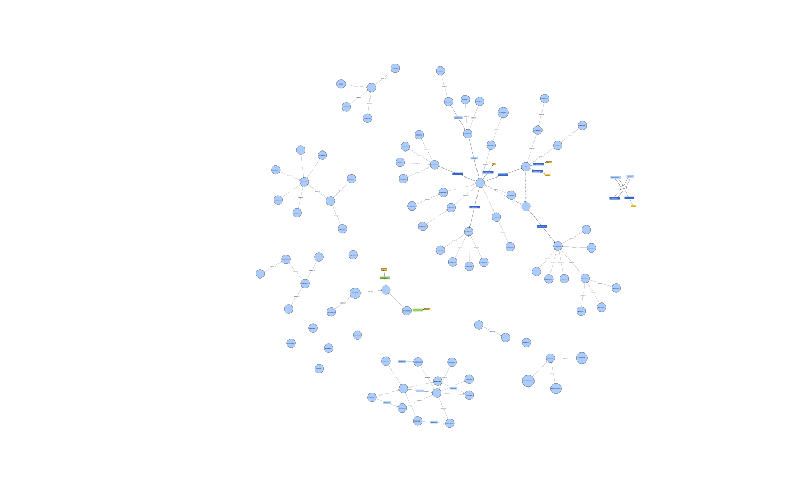

# O smartphone como veículo para algoritmos de retenção de usuários em aplicativos mobile

Repositório público dos artefatos finais do Trabalho de Conclusão de Curso.

## Conteúdo publicado


- `poc1-ontologies-owx-REVISION-HEAD/`: ontologia OWL/XML final usada no trabalho.
- [`Grafo_ontologia.svg`](Grafo_ontologia.svg): visualização do grafo da ontologia.
- [`POC2-relatorio-final.pdf`](POC2-relatorio-final.pdf): relatório final da POC2.
- `docs/Competency Questions`: Competency Questions.
- `foco_tela/`: código-fonte do protótipo Android/Flutter, sem artefatos de build.


## Visualização da ontologia



## Como validar a ontologia

```bash
xmllint --noout poc1-ontologies-owx-REVISION-HEAD/urn_webprotege_ontology_7543882f-929e-4586-bf29-1f3930cfc5f2.owx
```

A validação lógica com HermiT foi registrada nos documentos em `docs/ontologia/obsidian/mapeamento-owl/`.

## Relatório final

O relatório final da POC2 está disponível em [`POC2-relatorio-final.pdf`](POC2-relatorio-final.pdf).

## Como executar o protótipo

```bash
cd foco_tela
flutter pub get
flutter analyze
flutter test
```

O protótipo foi construído com foco Android. As permissões reais de Usage Access e Notification Listener dependem de execução em dispositivo Android compatível.
